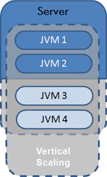
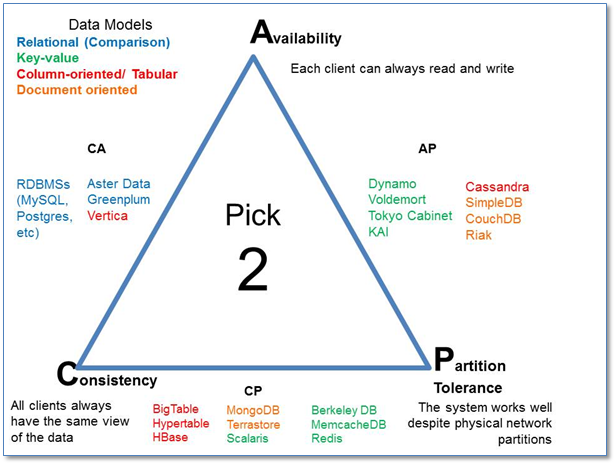
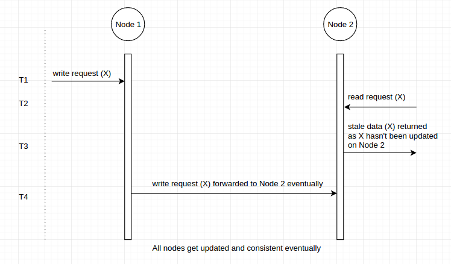
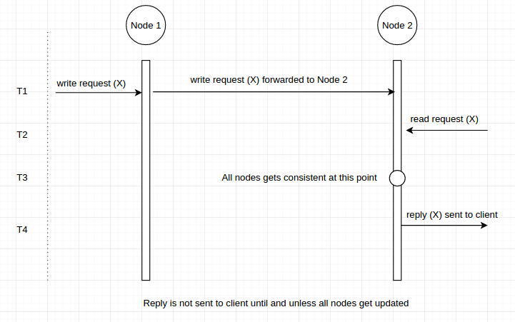
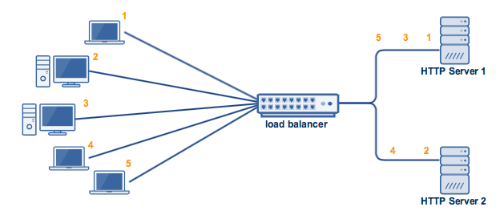
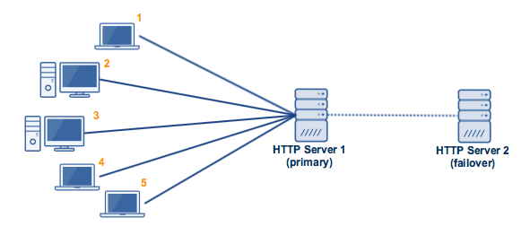
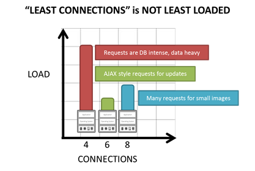
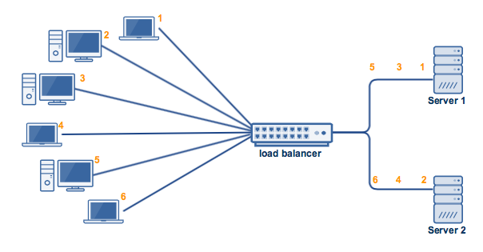

# README
## I. Các khái niệm
1. Performance vs scalability
- <b>Performance ( Hiệu suất) </b> ám chỉ đến khả năng làm việc của một system I, ví dụ như nó có thể xử lý một request trong thời gian bao lâu (responese time) , số lượng request mà system đó có thể xử lý trong một khoảng thời gian (throughput)
-  Khi performance của system thay đổi ( ví dụ như system phải phục vụ thêm user, hoặc thời gian sesponse giảm đi), lúc này để tăng hiệu suất  thì ta nói đến Scalability.
- <b>Scalability </b> là khả năng của một hệ thống có thể tăng performance bằng cách thêm các resources (server, cpu, ram  ...). Bất kể bao nhiêu hardware được thêm vào nhưng có thể quan sát được performance sẽ được tăng.

 2. cách tiếp cận với scalability

- <b>2.1 Vertical scaling : </b> Là phương pháp tăng khả năng chịu tại trên một nodes (nodes ở đây có thể là server), thêm các hardware reosurce cho một nodes. 
-   Ưu điểm: Không cần phải thay đổi lại kiến trúc hệ thống, 
-  Nhược điểm: Khả năng scalability bị ràng buộc với phần cứng tại mọi thời điểm

    

- <b> 2.2 horizontal scaling</b> Là phương pháp tăng tải của system bằng cách tăng thêm nodes. Bằng cách tiếp cận này, requests từ user sẽ được phân phối tới các nodes này. 
- ưu điểm: Xử lý được nhiều request trong một khoảng thời gian 
- Nhược điểm: cách tiếp cận này yêu cầu phải thiết kế sao cho các nodes phải xử lý các request đồng đều.
2. Latency vs throughput
- Latency is the time required to perform some action or to produce some result. Latency is measured in units of time -- hours, minutes, seconds, nanoseconds or clock periods. 
- Throughput is the number of such actions executed or results produced per unit of time. This is measured in units of whatever is being produced (cars, motorcycles, I/O samples, memory words, iterations) per unit of time. The term "memory bandwidth" is sometimes used to specify the throughput of memory systems.
3. Định lý CAP

    3.1 Định nghĩa
- Định lý CAP là định lý được Eric Brew viết năm 2002 nhằm đề xuất các quy luật cho hệ thống phân tán. Trong quy trình xây dựng 1 hệ thống phân tán bạn chỉ có thể chọn 2 trong 3 tính chất sau đây để xây dựng:
    * <b>Consistency (tính nhất quán về dữ liệu)</b> Trong hệ thống phân tán, dữ liệu giữa các nodes (server) phải được đồng nhất với nhau tại mọi thời điểm. Bất kể hành động read data sẽ đều trả về gíá trị của bản ghi write mới nhất.
    * <b> Availability (tính sẵn sàng của server)</b> Trong hệ thống phân tán, mỗi request đều nhận được một response. Avalability có được bằng cách hệ thống phải hoạt động bất kể mọi thời điểm. Mỗi client đều nhận được một response bất kể trạng thái của các nodes trên hệ thống. 
    * <b>Partition Tolerance </b> Hệ thống vẫn tiếp tục hoạt động kể cả trong trường hợp một số thông điệp bị trì hoãn hoặc mất giữa các nodes. Một hệ thống là partition-tolerance  nếu có bất kì failure network thì vẫn  không dẫn đến failure trên toàn hệ thống. Khi xây dựng hệ thống phân tán, Partition Tolerance không phải là một lựa chọn, nó là điều cấp thiết. Do đó ta phải chuyển đổi dữa tính Consitency và Availability. Bởi vì ta không thể duy trì 1 hệ thống mà có đủ 3 tính chất PAC.

    
4.  consistency pattern
    4.1 Weak consistency
    -  Cách tiếp cận này được sử dụng trong các ứng dụng yêu cầu real time. như chat video, realtime mutilplayer games. Ví dụ trong game online, nếu bạn mất kết nối mạng trong vài giây thì sau khi kết nối lại, bạn sẽ không xem lại được chuyện gì xảy ra trong vài giây vừa rồi 
     
    4.2 Eventual Consistency
    - Cách tiếp cận này đảm bảo dữ liệu giữa các nodes cuối cùng sẽ đồng nhất với nhau. Thời gian để dữ liệu của các nodes đồng nhất với nhau là không thể xác định được.
    - Eventual Consistency đảm bảo dữ liệu đồng nhất nhưng trong quá trình đồng nhất thì nếu có một request read thì dữ liệu trả về có thể là dữ liệu cũ.
    
    
    4.3 Strong Consistency
    - Cách tiếp cận này đảm bảo dữ liệu sẽ được đồng nhất với các nodes khác. Ngay khi có một write request gửi tới một trong số các nodes trên hệ thống. Trong khoảng thời gian dữ liệu trên các nodes được updated,  thì lúc này nếu có các write/read request cho dữ liệu này gửi đến bất kỳ nodes nào cũng sẽ bị delayed bời vì các nodes này đang phải đồng nhất dữ liệu này. Ngay sau khi dữ liệu này được đồng nhất, hệ thống sẽ xử lý các requests đã bị delayed
    - Strong consistency đảm bảo toàn bộ dữ liệu được đồng nhất nhưng high lantency

    

5. Availability patterns

    5.1 Active-active 

    

    - Một Cluster active-active trong thực tế thường được tạo ra bởi ít nhất 2 nodes, tất cả các nodes của cụm đều chạy đồng thời một dịch vụ cùng lúc. Mục đích chính của một active-active cluter là để cân bằng tải (load balancing). Load balancing phân phối workload giữa các node nhằm ngăn chặn tình trạng overloaded trên các nodes. Do đó, càng nhiều nodes phục vụ thì sẽ tăng throughput và response time.
    - Cấu hình các nodes trên trong cluster phải giôngs nhau.
    - Setup: Two Adaptive Servers are configured as companion servers, each with independent workloads. These companions run on the primary and secondary nodes, respectively, as individual servers until one fails over.

- Failover: When fail over occurs, the secondary companion takes over the devices, client connections, and so on from the primary companion. The secondary companion services the failed-over clients, as well as any new clients, until the primary companion fails back and resumes its activities.

- Failback: Failback is a planned event during which the primary companion takes back its devices and client connections from the secondary companion to resume its services.

- Client connection failover: During failover, clients connect to the secondary companion to resubmit their uncommitted transactions. During failback, clients connect to the primary companion to resubmit their transactions. Clients with the failover property reestablish their connections automatically.

    5.2 Active-passive 
    
     
    - Như cách mà active-active cluster phân cụm, active-passive cũng được tạo ra bởi ít nhất 2 nodes. Tuy nhiên, không phải tất cả các nodes đều hoạt động, nếu node đầu tiên hoạt động, thì node thứ 2 đứng gần không hoạt động. hay có thể nói nodes thứ 2 này là nodes dự phòng trong trường hợp nodes thứ nhất không hoạt động. 
    - Setup: A single Adaptive Server runs either on the primary node or on the secondary node. The Adaptive Server runs on the primary node before a fail over and the secondary node after fail over.

- Failover: When a system fails over, the Adaptive Server and its associated resources are relocated to, and restarted on, the secondary node.

- Failback: Failback is a planned fail over or relocation of the Adaptive Server and its resources to the primary node. Failback is not required, but can be done for administrative purposes.

- Client connection failover: During failover and failback, clients connect to the same Adaptive Server to resubmit uncommitted transactions. Clients with the failover property reestablish their connections automatically.

    <b> Nhược điểm của Fail-over </b>
    * Fail-over yêu cầu nhiều thiết bị phần cứng và yêu cầu sự phức tạp.
    * Có thể mất dữ liệu nếu active system bị lỗi trước khi dữ liệu được sao chép qua passive system.
6. Replication
    
    6.1  Master-slave replication
    - Master server thực hiện read and write data, dữ liệu trên master server được sao chép tới các slave server.  slave server chỉ có chức năng đọc dữ liệu
    - nếu master server sập, hệ thống tiếp tục hoạt động trên các slave server nhưng chỉ thực hiện read data
     

    6.2 Master-master replication
    - cả hai master server thực hiện đọc và write đồng nhất với nhau, nếu một trong hai master server sập, hệ thống tiếp tục hoạt động với read và write data

    

    6.3 Sharding 
    - Phương pháp sharding phân bố data qua nhiều database, những database này chỉ lưu giữ một phần của dữ liệu.  Khi dữ liệu 1 loại tăng lên, thì số lượng datase cần đề lưu trữ tăng lên.
    - ưu điểm: sharding giảm các vấn đề về read/write dữ liệu, giảm việc sao chép, xung đột bộ nhớ cache. Nếu một phân vùng sập, các phân vùng khác tiếp tục hoạt động. Việc write dữ liệu được thực hiện song son dẫn đến tăng throughput
    - Nhược điểm: 
        * join data từ nhiều vùng trở nên phức tạp
        * sử dụng nhiều phần cứng 
7. Load balancer

- Load balancer là một phương thức phân phối request từ clients tới các servers hoặc database.
- <b>Các thuật toán và phương thức cho load balancing</b>
    * <b>Least connection Method</b>:  Khi load balancer nhận được một requests từ client. nó sẽ chuyển hương request này tới server đang xử lý ít conections nhất.
    * <b>Least loaded Mothod</b>: Khi load balancer nhận được một requests từ client. nó sẽ chuyển hương request này tới server đang chịu tải ít nhất. Cần phân biệt giữa hai khái niệm Least connection với Least loaded
    
     

    [tham khảo thêm](https://devcentral.f5.com/articles/back-to-basics-least-connections-is-not-least-loaded)
    
    * <b>Round Robin Method</b>:  Phương pháp này sử trụng một danh list các servers, Khi load balancer nhận được một requests từ client. nó sẽ chuyển hương request này tới server nằm đầu danh sách, lập tức sau đó nó sẽ chuyển server này xuống cuối danh sách. các request tiếp theo cứ tiếp tục như vậy.
    
     

    - Ví dụ như hình trên, có 2 server phía sau load balancer, và có 6 clients gửi lần lượt request theo thứ tự tới servers. lúc này load balancer sẽ phân bố request từ client 1 tới server 1, sau đó là request từ client2 tới server 2, sau nữa là request từ client 3 tới server 1, quá trình sẽ tiếp tục như vậy đến khi các requests đều được phân bố tới các server.
    - Có thể thấy phương pháp này khá đơn giản, tuy nhiên nó dường như không tốt trong một số trường hợp.
    - Ví dụ: Nếu server 1 có nhiều hơn CPU, RAM,.. hơn server 2, thì server 1 nên xử lý nhiều requests nhiều hơn server 2. Để giải quyết trường hợp này thì Round robin được cải tiến hơn nữa là Weighted Round Robin

    * <b>Weighted Round Robin</b>
    - Cũng như Round robin , phương pháp này phân phối request đến server lần lượt, tuy nhiên số lượng requests đến một server sẽ phụ thuộc vào trọng số của server đó. Trọng số weight càng cao đồng nghĩa với việc server đó có khả năng xử lý nhiều request hoặc chịu tải cao.
    - Ví dụ nếu server 1 có weigh là 3, server 2 có weight là 1, thì lúc này load balancer sẽ phân phối 3 requests cho server 1 và 1 request cho server 2

    * Random Method:  Phương pháp này sử dụng một thuật toán ngẫu nhiên để phân bố các requests từ clients tới các servers sao cho đồng đều.
